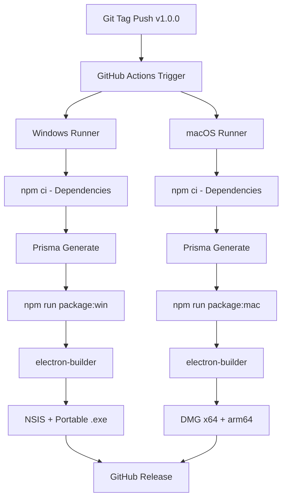

# GitHub Actions CI/CD Setup - Mbit ERP Desktop

## 🎯 Áttekintés

Ez a dokumentáció leírja, hogyan kell beállítani a GitHub Actions CI/CD pipeline-t a Mbit ERP Desktop alkalmazás automatikus build-eléséhez **Windows** és **macOS** installer-ekhez.

---

## 📋 Előfeltételek

### 1. GitHub Repository Beállítása

**FONTOS**: Először frissítsd a `README.md` fájlban a placeholder értékeket:
```markdown
<!-- README.md-ben cseréld le: -->
ORG_NAME  → a te GitHub szervezeted vagy username-ed
REPO_NAME → a repository neve (pl. mbit-erp)

Példa:
[]...
```

```bash
# Repository inicializálása (ha még nincs)
git init
git add .
git commit -m "Initial commit - Mbit ERP Desktop"

# GitHub repo létrehozása és remote hozzáadása
# Cseréld le ORG_NAME/REPO_NAME-et a saját értékeiddel!
git remote add origin https://github.com/ORG_NAME/REPO_NAME.git
git push -u origin main
```

### 2. GitHub Secrets Konfigurálása

A GitHub repository Settings → Secrets and variables → Actions menüben add hozzá a következő secret-eket:

#### 🔐 Kötelező Secrets

| Secret név | Leírás | Generálás |
|------------|--------|-----------|
| `GITHUB_TOKEN` | Automatikusan elérhető | ❌ Nem kell beállítani |

#### 🔐 Opcionális - Code Signing (Javasolt Production-hez)

**Windows Code Signing:**

| Secret név | Leírás | Használat a workflow-ban |
|------------|--------|-----------------------|
| `WINDOWS_CSC_LINK` | Base64 enkódolt `.p12` vagy `.pfx` certificate | `CSC_LINK` env változóként |
| `WINDOWS_CSC_KEY_PASSWORD` | Certificate jelszó | `CSC_KEY_PASSWORD` env változóként |

Generálás:
```bash
# Windows certificate Base64 enkódolása
base64 -i your-certificate.p12 -o certificate-base64.txt
# Vagy Windows-on:
certutil -encode your-certificate.p12 certificate-base64.txt
```

**macOS Code Signing:**

| Secret név | Leírás | Használat a workflow-ban |
|------------|--------|-----------------------|
| `MACOS_CSC_LINK` | Base64 enkódolt `.p12` certificate (Developer ID Application) | `CSC_LINK` env változóként |
| `MACOS_CSC_KEY_PASSWORD` | Certificate jelszó | `CSC_KEY_PASSWORD` env változóként |
| `APPLE_ID` | Apple ID email (notarization-hez) | `APPLE_ID` env változóként |
| `APPLE_ID_PASSWORD` | App-specific password | `APPLE_ID_PASSWORD` env változóként |
| `APPLE_TEAM_ID` | Apple Team ID | `APPLE_TEAM_ID` env változóként |

Generálás:
```bash
# macOS certificate Base64 enkódolása
base64 -i DeveloperID.p12 -o macos-cert-base64.txt
```

**⚠️ Megjegyzés**: Code signing nélkül is működnek az installer-ek, de Windows/macOS biztonsági figyelmeztetést fog mutatni a felhasználóknak.

---

## 🚀 Automatikus Build Triggerek

A GitHub Actions workflow automatikusan fut:

### 1. **Git Tag Push** (Ajánlott Production Release-hez)
```bash
git tag v1.0.0
git push origin v1.0.0
```

**Eredmény**: 
- ✅ Windows installer-ek: `Mbit ERP-Setup-1.0.0.exe`, `Mbit ERP-1.0.0.exe` (portable)
- ✅ macOS installer-ek: `Mbit ERP-1.0.0-x64.dmg`, `Mbit ERP-1.0.0-arm64.dmg`
- ✅ Automatikus **GitHub Release** létrehozása installer-ekkel

### 2. **Push to Main/Master Branch**
```bash
git push origin main
```

**Eredmény**: Build fut, artifact-ek feltöltődnek (30 napos megőrzéssel), de nincs Release

### 3. **Pull Request**
```bash
# PR létrehozása
```

**Eredmény**: Build validation (ellenőrzi hogy nincs-e hiba)

### 4. **Manuális Futtatás**
GitHub UI → Actions → Build Desktop App → Run workflow

---

## 📦 Build Kimenet

### Windows Installer-ek

- **NSIS Installer**: `Mbit ERP-Setup-1.0.0.exe`
  - Full installer telepítő varázslóval
  - Testreszabható telepítési hely
  - Desktop + Start Menu shortcut
  - Uninstaller

- **Portable**: `Mbit ERP-1.0.0.exe`
  - Telepítés nélküli futtatható
  - USB drive-ra másolható
  - Hordozható adatbázis

### macOS Installer-ek

- **Intel Mac**: `Mbit ERP-1.0.0-x64.dmg`
  - Intel processzorú Mac-ekhez
  
- **Apple Silicon**: `Mbit ERP-1.0.0-arm64.dmg`
  - M1/M2/M3 chip-es Mac-ekhez
  - Natív ARM teljesítmény

---

## 🔍 Build Folyamat Áttekintése



---

## 🛠️ Build Script Működése

### Automatikus Cache Cleanup

A build script-ek automatikusan törlik a TypeScript `.tsbuildinfo` cache fájlokat:

```json
{
  "prebuild": "npm run clean && npx rimraf \"**/*.tsbuildinfo\" tsconfig.tsbuildinfo",
  "build:electron": "npx rimraf tsconfig.tsbuildinfo && tsc",
  "build:backend": "cd ../server && npx rimraf tsconfig.tsbuildinfo && npm run build",
  "build:frontend": "cd ../web && npx rimraf tsconfig.tsbuildinfo && cross-env ELECTRON_BUILD=true npm run build"
}
```

Ez biztosítja, hogy a dist mappák mindig helyesen generálódjanak.

### Icon Konverzió

Az electron-builder **automatikusan** konvertálja a `resources/icon.png` fájlt:
- **Windows**: `.ico` formátumba
- **macOS**: `.icns` formátumba

Nincs szükség manuális icon generálásra.

---

## 🧪 Helyi Tesztelés CI Build Előtt

Teszteld a build-et lokálisan, mielőtt GitHub-ra pusholnád:

```bash
# 1. Dependencies telepítése
npm ci

# 2. Prisma client generálás
cd apps/server && npx prisma generate && cd ../..

# 3. Desktop app build
cd apps/desktop

# Windows build (csak Windows-on működik)
npm run package:win

# macOS build (csak macOS-on működik)
npm run package:mac
```

**Eredmény**: `apps/desktop/release/` mappában megjelennek az installer-ek.

---

## ⚠️ Gyakori Hibák és Megoldások

### 1. **Hiba: "dist folder not found"**

**Ok**: TypeScript cache (.tsbuildinfo) blokkolja a dist generálást

**Megoldás**:
```bash
# Manuális cache törlés
find . -name '*.tsbuildinfo' -delete

# Vagy npm script:
cd apps/desktop && npm run prebuild
```

### 2. **Hiba: "Prisma Client not found"**

**Ok**: Prisma client nincs generálva

**Megoldás**:
```bash
cd apps/server
npx prisma generate
```

### 3. **Windows Code Signing Figyelmeztetés**

**Ok**: Nincs code signing certificate

**Megoldás**:
- ✅ **Production**: Vásárolj Windows Code Signing certificate-et (~$80-200/év)
- ⚠️ **Testing**: Engedélyezd a "Run anyway" opciót Windows-on

### 4. **macOS Gatekeeper Blokkolás**

**Ok**: Nincs Apple Developer certificate és notarization

**Megoldás**:
- ✅ **Production**: Apple Developer Program ($99/év) + notarization
- ⚠️ **Testing**: Jobb klikk + "Open" macOS-en, vagy:
  ```bash
  xattr -cr "Mbit ERP.app"
  ```

---

## 📊 Build Időtartamok

| Platform | Átlagos Build Idő | Runner |
|----------|-------------------|---------|
| Windows | ~8-12 perc | windows-latest |
| macOS | ~10-15 perc | macos-latest |

**Total**: ~20-25 perc mindkét platform párhuzamos build-elésével

---

## 🔄 Frissítési Folyamat

### Új Verzió Release-elése

```bash
# 1. Frissítsd a verzió számot
cd apps/desktop
npm version 1.1.0  # vagy minor, patch, major

# 2. Commit és tag
git add .
git commit -m "Release v1.1.0"
git tag v1.1.0

# 3. Push
git push origin main
git push origin v1.1.0

# 4. Várj ~20-25 percet
# 5. Ellenőrizd: https://github.com/ORG/REPO/releases
```

### Release Asset-ek Letöltése

```
https://github.com/ORG/REPO/releases/tag/v1.1.0

Elérhető fájlok:
- Mbit ERP-Setup-1.1.0.exe       (Windows NSIS)
- Mbit ERP-1.1.0.exe              (Windows Portable)
- Mbit ERP-1.1.0-x64.dmg          (macOS Intel)
- Mbit ERP-1.1.0-arm64.dmg        (macOS Apple Silicon)
```

---

## 🔒 Biztonsági Best Practices

### 1. **Secrets Kezelése**

- ❌ **SOHA** ne commitolj certificate-eket vagy jelszavakat a repo-ba
- ✅ Használd a GitHub Secrets-et minden érzékeny adathoz
- ✅ Rendszeresen rotáld az App-specific password-öket

### 2. **Code Signing**

- ✅ Használj Extended Validation (EV) certificate-et Windows-hoz (instant trust)
- ✅ macOS notarization kötelező macOS 10.15+ támogatáshoz
- ✅ Tartsd biztonságos helyen a private key-eket

### 3. **Environment Változók**

Az alkalmazás automatikusan generálja:
- `JWT_SECRET`: Default érték production-ben, éles használathoz változtasd!
- `DATABASE_URL`: User data directory-ban SQLite
- `DATA_DIR`: User-specific data folder

---

## 📞 Támogatás

**Build problémák esetén**:
1. Ellenőrizd a GitHub Actions log-okat
2. Nézd meg a [BUILD_DESKTOP.md](BUILD_DESKTOP.md) fájlt
3. Futtasd lokálisan a build-et debug-oláshoz

**Code Signing segítség**:
- Windows: [Microsoft Code Signing](https://docs.microsoft.com/en-us/windows/win32/appxpkg/how-to-sign-a-package-using-signtool)
- macOS: [Apple Developer Documentation](https://developer.apple.com/documentation/security/notarizing_macos_software_before_distribution)

---

## ✅ Checklist - Production Release Előtt

- [ ] **README.md frissítve** - ORG_NAME/REPO_NAME placeholder-ek lecserélve valós értékekre
- [ ] GitHub repository létrehozva és konfigurálva
- [ ] GitHub Actions workflow tesztelve (legalább 1 sikeres build)
- [ ] Code signing certificate-ek beszerzve és GitHub Secrets-be feltöltve (opcionális de ajánlott)
  - Windows: WINDOWS_CSC_LINK, WINDOWS_CSC_KEY_PASSWORD
  - macOS: MACOS_CSC_LINK, MACOS_CSC_KEY_PASSWORD, APPLE_ID, APPLE_ID_PASSWORD, APPLE_TEAM_ID
- [ ] Windows installer lokálisan tesztelve
- [ ] macOS installer lokálisan tesztelve
- [ ] Release notes előkészítve
- [ ] Verzió szám frissítve package.json-ban
- [ ] Git tag létrehozva és pusholva
- [ ] GitHub Release ellenőrizve és publikálva
- [ ] Installer-ek letöltve és végfelhasználói eszközön tesztelve

---

**Készítve**: 2025 November 7  
**Verzió**: 1.0.0  
**Projekt**: Mbit ERP Desktop Application
